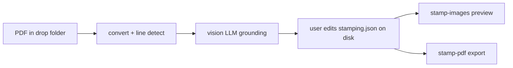
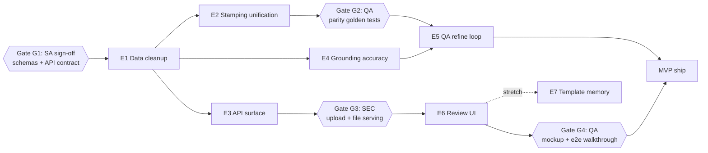

# Formiqo MVP — Product Requirements Document

| | |
|---|---|
| **Product** | Formiqo — browser-based PDF form autofill review and export |
| **Version** | 1.0 (MVP) |
| **Status** | Approved for build |
| **Last updated** | 2026-07-12 |
| **Execution model** | Multi-agent harness (PM-routed epics, role owners, stop-the-line quality gates) |

This PRD is structured for a multi-agent build in the style of a structured agency harness
(inspired by [10Legs/freelance-developer-harness](https://github.com/10Legs/freelance-developer-harness)).
Every epic declares an **owner role**, **dependencies**, **scope**, and **acceptance criteria**.
Gates are stop-the-line: work must not advance past a gate until the named role signs off.

---

## 1. Product overview and goals

### 1.1 Problem

Many real-world PDF forms are flat or scanned — they have no fillable AcroForm widgets.
Formiqo fills these forms by rasterizing pages, detecting printed lines with OpenCV, and
using a vision LLM to locate fillable fields ("grounding"). AI grounding is imperfect:
values can land slightly off their writing line, in the wrong cell, or at the wrong size.

Today the only way to review and correct a filled form is to hand-edit JSON files on disk
and re-run API calls from Swagger. There is no user interface.

### 1.2 MVP definition

A user can, entirely in the browser:

1. **Upload** a PDF form.
2. Wait while the system **auto-detects and grounds** the fillable fields.
3. **Review** the filled form: click fields, drag or nudge them, edit values, adjust font size.
4. **Export** a final flattened PDF and download it.

No authentication. Single-operator deployment.

### 1.3 Non-goals (MVP)

- XFA form support (hard-rejected at intake, with a clear user-facing message).
- OCR of handwriting.
- Multi-tenancy, accounts, or login.
- Mobile layouts (desktop-first).

### 1.4 Success metrics

- **Correction rate:** percentage of grounded fields requiring manual position/value correction (target: trending down as E4/E5 land).
- **Time-to-export:** wall-clock time from upload to downloaded PDF for a typical 2-page form.
- **QA-loop convergence:** percentage of refinement runs that converge before `grounding_qa_max_iterations`.
- **Preview parity:** zero visual mismatches between the stamped image preview and the exported PDF on the golden test set.

---

## 2. Current state summary

The repo is a Python 3.11 FastAPI backend with no frontend and no database. All state is
filesystem-based under `data/jobs/{uuid}/`.

### 2.1 Existing pipeline (3 API-driven steps)

| Step | Endpoint | Key modules |
|---|---|---|
| 1. Prepare | `POST /api/v1/user-uploads/process-convert-line-detect` | `app/services/pdf_pipeline/intake.py`, `scripts/convert_pdf_pages_for_grounding.py`, `app/services/line_detector.py` |
| 2. Ground | `POST /api/v1/jobs/{job_id}/ground-fields-from-lines` | `app/services/semantic_grounding.py`, `app/services/form_geometry.py`, `app/services/grounding_prompt.py` |
| 3. Fill/export | `POST /api/v1/jobs/{job_id}/stamp-images`, `POST /api/v1/jobs/{job_id}/stamp-pdf` | `app/services/image_stamping.py`, `app/services/pdf_stamping.py` |

### 2.2 Core design facts every agent must respect

- **Coordinate system:** all field bboxes live in **top-left pixel space** of the rendered
  page PNGs (200 DPI default). PDF output is derived via a linear transform
  (`_map_bbox_to_pdf_points` in `app/services/pdf_stamping.py`). Page manifests under
  `output/converted_images/pages/page_XXXX.json` are the source of truth for the mapping.
- **Field schema:** each field has `field_id`, `type` (`text`, `multiline_text`, `checkbox`,
  `radio`, ...), and `bbox: {x, y, w, h}` in pixels. Values live separately in
  `output/field_grounding/stamping.json` as a flat `{field_id: value}` map.
- **Export is already flattened in effect:** `stamp-pdf` uses `page.insert_text()` /
  `page.draw_line()`, which bake content into the page content stream (no widgets or
  annotations to flatten).
- **XFA PDFs are rejected**; AcroForm PDFs are classified by
  `app/services/pdf_pipeline/detector.py` but currently go through the same image pipeline.

### 2.3 Known defects and debts (from code review)

1. `output/document_manifest.json` and `output/converted_images/manifest.json` are duplicates.
2. Field JSON stores each label 3–4 times (`label`, `nearby_label_text`, `evidence.label`,
   `supporting_lines` == `evidence.line_ids`).
3. Page manifests triplicate dimensions (`width_px` == `rendered_image_width_px` ==
   `saved_image_width_px`).
4. `~200` lines are near-duplicated between `image_stamping.py` and `pdf_stamping.py`
   (validation, discovery, run-manifest scaffold).
5. **Preview ≠ PDF:** different fonts (DejaVu/Arial vs Helvetica), incompatible size
   semantics (`font_size_px: 22` vs `font_size_pt: 11`, unrelated), different overflow
   behavior (ellipsis-truncate vs overflow).
6. `stamp-pdf` ignores styles from `stamping.json` (hardcodes `StampPdfStyle()`).
7. `multiline_text` renders as a single line — no wrapping.
8. Sample `stamping.json` values are `field_id[:10]` placeholder junk.
9. Dead code/config: unreachable raise in `semantic_grounding.py` (`_call_grounding_llm_raw`),
   `grounding_qa_*` settings for an unimplemented `/refine-grounding`, `combined_default_*`
   models for a non-existent `/convert-and-ground`, `pytest` in prod `requirements.txt`.
10. Grounding runs pages sequentially; a 10-page form can take 5–10 minutes.
11. No upload endpoint, no GET/PATCH endpoints, no job status — the UI cannot be built
    against the current API.
12. Stamp runs accumulate under `stamped_images/`/`stamped_pdfs/` with no retention.

---

## 3. Epics (role-routed)

Roles: **SA** = Solution Architect, **BE** = Backend Developer, **LLM** = LLM Engineer,
**FE** = Frontend Developer, **QA** = QA Specialist, **SEC** = Security Reviewer.

---

### E1 — Data model cleanup

| | |
|---|---|
| **Owner** | Backend Developer |
| **Dependencies** | None (starts immediately after Gate G1 sign-off on schemas) |
| **Debts addressed** | 2.3 items 1, 2, 3, 8, 12 |

**Scope**

1. Replace `output/document_manifest.json` with a true **job manifest** (`job.json` at job
   root or equivalent) carrying:
   - `job_id`, `source_filename`, `created_at`, `updated_at`
   - `status`: `converting | grounding | ready | failed | exported`
   - `page_count`, `dpi`, `detected_pdf_type`
   - per-stage results/errors (e.g., failed page indices with messages)
   - Delete the duplicated `converted_images/manifest.json` content (keep at most one
     conversion-level manifest; do not store the same data twice).
2. Deduplicate the field schema written by `write_field_grounding_outputs` /
   `adapt_grounding_response` in `app/services/semantic_grounding.py` and
   `app/services/grounding_prompt.py`:
   - Keep: `field_id`, `type`, `bbox`, `confidence`, `label`, `evidence.line_ids`,
     `grounding_type` (when it differs from `type`).
   - Drop: `nearby_label_text`, `supporting_lines`, `evidence.label`.
3. Collapse triplicated page-manifest dimensions to a single `width_px`/`height_px` pair;
   drop the `mapping.formula` documentation strings (the formula is code, not data). Keep
   `image_to_pdf_scale_x/y`.
4. Slim `detected_lines.json`: store `line_id`, `orientation`, `bbox`, `thickness`,
   `line_style` (drop redundant `x1,y1,x2,y2` endpoints derivable from bbox).
5. Sample `stamping.json` values default to **empty strings** (both stampers already skip
   empty values), never `field_id[:10]`.
6. Stamped-run retention: keep the **last N runs** (config, default 3) per job for both
   `stamped_images/` and `stamped_pdfs/`; prune older runs on new stamp calls.

**Acceptance criteria**

- One job manifest exists per job with a status field; no duplicated manifest files.
- A grounded field JSON file contains no duplicated label/line data; existing readers
  (`image_stamping.py`, `pdf_stamping.py`, `stamping_config.py`) updated in the same change.
- All existing tests pass; new unit tests cover the job manifest read/write and status
  transitions.
- Golden job fixture in `tests/` reflecting the new on-disk layout.

---

### E2 — Stamping engine unification (preview/PDF parity)

| | |
|---|---|
| **Owner** | Backend Developer |
| **Dependencies** | E1 |
| **Debts addressed** | 2.3 items 4, 5, 6, 7, 9 |

**Scope**

1. Extract `app/services/stamping_common.py`: bbox validation (`_bbox_from_field`), page
   input validation (`_validate_page_inputs`), page discovery
   (`_discover_grounding_pages`), grounding-run assertion, hex-color validation, JSON
   loading, and the run-loop + run-manifest scaffold shared by both stampers. Each stamper
   keeps only its renderer.
2. **One style model, defined in PDF points.** Pixel sizes derive from the page's
   image-to-PDF scale (from the page manifest). `stamping.json` carries a single `style`
   (replacing `image_style`) plus optional **per-field overrides** (`font_size_pt` minimum;
   design the override map so position/color can join later).
3. **Font parity:** ship one TTF (e.g., DejaVu Sans) used by Pillow for previews and
   embedded into the PDF via `page.insert_text(..., fontfile=...)`. Font-fit logic must use
   the same font metrics on both paths.
4. **Placement parity:** text sits on the writing line (baseline a few px above the bbox
   bottom edge), identical on both paths. Fix the PDF path's ascent approximation
   (`rect.y0 + font_size`) using real font metrics so descenders don't clip.
5. **Overflow parity:** identical shrink-then-truncate-with-ellipsis behavior on both paths.
6. **Multiline wrapping** for `multiline_text`: word-wrap within bbox width, shrink font if
   needed, identical line-breaking on both paths.
7. `stamp-pdf` reads style from `stamping.json` (no more hardcoded `StampPdfStyle()`).
8. Cache font loading (`functools.lru_cache`) — `_load_font` currently hits disk per
   candidate size per field.
9. Dead code removal: unreachable raise in `semantic_grounding._call_grounding_llm_raw`;
   redundant `NO_CONVERTED_PAGE_PNGS` except-branch in `app/routers/grounding.py`;
   `combined_default_*` config keys (fold into `grounding_model` defaults); move `pytest`
   to `requirements-dev.txt` only. Keep `grounding_qa_*` settings — E5 consumes them.

**Acceptance criteria**

- No duplicated validation/discovery/manifest logic between the two stampers.
- Golden-file test set (at least 2 forms, mixed text/checkbox/multiline): rendering the
  stamped PNG preview and rasterizing the stamped PDF page produce visually matching output
  (text position within a small pixel tolerance, same wrapping, same truncation).
- Per-field `font_size_pt` override round-trips: set in `stamping.json`, honored by both paths.
- **Gate G2 (QA):** parity golden tests pass before E5 starts.

---

### E3 — API surface for the UI

| | |
|---|---|
| **Owner** | Backend Developer |
| **Dependencies** | E1 (job manifest/status); parallel with E2 |
| **Debts addressed** | 2.3 item 11; router awkwardness |

**Scope**

1. `POST /api/v1/jobs` — multipart PDF upload (use existing `python-multipart`; enforce
   `Settings.max_upload_bytes` and PDF content-type/magic check). Creates the job, then runs
   convert → line-detect → grounding as a **background task**, updating job status at each
   stage (`converting` → `grounding` → `ready` / `failed`). XFA rejection returns a clear
   400 with the existing user message.
2. `GET /api/v1/jobs` — list jobs (id, source filename, page count, status, created_at).
3. `GET /api/v1/jobs/{id}` — job detail for status polling: status, stage progress
   (e.g., grounded page x of n), per-page errors, available artifacts.
4. `GET /api/v1/jobs/{id}/pages/{n}/image` — page PNG (`FileResponse`); also latest stamped
   preview image when present.
5. `GET /api/v1/jobs/{id}/fields` — all grounded fields (all pages) plus current values and
   style, in one payload shaped for the editor.
6. `PATCH /api/v1/jobs/{id}/fields` — persist edits: bbox moves, per-field `font_size_pt`,
   review flags. Writes back to `page_XXXX.fields.json`.
7. `PATCH /api/v1/jobs/{id}/values` — persist value edits into `stamping.json`.
8. `GET /api/v1/jobs/{id}/export` — download the latest stamped PDF; `POST .../stamp-pdf`
   marks the job `exported`.
9. `DELETE /api/v1/jobs/{id}` — remove a job (jobs-list trash action).
10. Drop the redundant `provider` body parameter on `stamp-images`/`stamp-pdf` (a job has
    exactly one grounding run; read the manifest).
11. Serve the built frontend via `StaticFiles` (preferred — avoids CORS); keep the existing
    `cors_allow_origins` setting for dev mode.
12. Keep the existing drop-folder batch endpoint working (CLI/batch use) but mark it as a
    secondary intake path in OpenAPI docs.

**Acceptance criteria**

- Full happy path exercised by an integration test using `httpx` (already in dev deps):
  upload → poll to `ready` → GET fields → PATCH a bbox and a value → stamp-images →
  stamp-pdf → download export.
- Upload rejects: oversize files, non-PDFs, XFA PDFs — each with a distinct, user-readable
  error body.
- File-serving endpoints resolve paths strictly inside the job directory (no traversal).
- **Gate G3 (SEC):** security review of upload validation and file serving before E6
  integration begins.

---

### E4 — Grounding accuracy

| | |
|---|---|
| **Owner** | LLM Engineer |
| **Dependencies** | E1 (field schema); parallel with E2/E3 |
| **Debts addressed** | 2.3 item 10; coordinate accuracy |

**Scope**

1. **Structured outputs.** Replace regex fence-stripping + compact-JSON retry in
   `semantic_grounding.py` with OpenAI strict `json_schema` response format and Anthropic
   tool-use. The `OutputTruncatedError`/compact-retry path shrinks to a thin fallback.
2. **Parallel per-page grounding** with bounded concurrency (config, default 3–4 workers).
   Preserve per-page error isolation and per-page status reporting into the job manifest.
3. **Anchor-first grounding** (the accuracy step-change). Change the contract with the
   model from "output pixel bboxes" to "output references":
   - The model references detected `line_id`s / cell bounds (it already receives them) —
     e.g., "fills the cell bounded by line_h_008 / line_h_010 / line_v_001 / line_v_003".
   - For digital (non-scanned) PDFs, extract label positions with PyMuPDF
     `page.get_text("words")` and pass them as anchors; the model names the anchor label,
     and the bbox is computed deterministically in `app/services/form_geometry.py` from
     line geometry + anchor position.
   - Fallback for unanchored fields: raw pixel estimate against an image overlaid with a
     **labeled coordinate grid** (ticks every 100 px), which materially improves LLM
     coordinate accuracy.
4. Persist a per-field `grounding_source` (`cell | line_anchor | label_anchor | pixel`) and
   `confidence` so the UI and E5 can prioritize review of low-trust fields.

**Acceptance criteria**

- Zero JSON parse failures across the regression form set (structured outputs).
- A 5-page document grounds in roughly the time of its slowest 2 pages (concurrency), not
  the sum of all pages.
- On the regression set, median bbox center error vs. hand-labeled truth improves over the
  pixel-only baseline; report the before/after numbers in the epic's QA note.
- Prompts in `prompts/` updated and versioned; `tests/test_grounding_prompt.py` extended.

---

### E5 — Vision QA refinement loop (agent-harness feature)

| | |
|---|---|
| **Owner** | LLM Engineer |
| **Dependencies** | E2 (parity stamping), E4 (grounding source/confidence) |
| **Debts addressed** | Implements the endpoint the `grounding_qa_*` config already anticipates |

**Scope**

1. Implement `POST /api/v1/jobs/{id}/refine-grounding` as a closed loop:
   - Stamp a numbered **debug preview** (existing `draw_debug_boxes` + field numbering,
     via `stamp_qa_preview_pages()` in `image_stamping.py`).
   - **Judge:** send per-field **zoomed crops** (~3x around the stamped bbox) to a vision
     model — preferably a different model/provider than the grounder to avoid correlated
     blind spots — asking a narrow question: "is this value correctly positioned on its
     line / in its cell? If not, direction and rough magnitude."
   - Apply **bounded deltas** (`grounding_qa_max_bbox_delta_px`, default 30 px/axis/iteration),
     with consensus translation merging per the existing
     `grounding_qa_consensus_*` settings when many fields on a page agree on one shift.
   - Re-stamp and iterate until the judge reports clean or `grounding_qa_max_iterations`
     (default 6) is reached.
2. Persist per-field QA outcome (`qa_status`: `confirmed | adjusted | flagged`) and final
   confidence; the UI surfaces `flagged` fields as "check this field".
3. Run refinement automatically as the final stage of the E3 background pipeline (config
   toggle), and expose it manually via the endpoint for re-runs after user edits.

**Acceptance criteria**

- On the regression set, the loop strictly reduces (or leaves unchanged) median bbox error;
  it never moves a field by more than the configured per-iteration bound.
- Convergence rate and iteration counts logged per job; surfaced in `GET /jobs/{id}`.
- A form with deliberately perturbed bboxes (test fixture) is measurably corrected.
- Judge cost/latency documented (tokens per page per iteration) so the auto-run default can
  be tuned.

---

### E6 — Review UI frontend

| | |
|---|---|
| **Owner** | Frontend Developer |
| **Dependencies** | E3 (API). E5's flags enhance but do not block the UI. |
| **Design source of truth** | Mockups in `docs/mockups/` (see below) |

**Visual spec — the six approved mockups:**

| Screen / state | Mockup |
|---|---|
| Jobs list (home, all status variants) | `docs/mockups/formiqo-jobs-list.png` |
| Upload page (drag-over, uploading, XFA warning) | `docs/mockups/formiqo-upload-page.png` |
| Job processing state (pipeline checklist + progress) | `docs/mockups/formiqo-processing-state.png` |
| Review editor (core screen) | `docs/mockups/formiqo-review-ui-mockup.png` |
| Export success modal (over dimmed editor) | `docs/mockups/formiqo-export-success.png` |
| Job failed state (per-page errors, retry) | `docs/mockups/formiqo-failed-state.png` |

**Stack:** React 18 + TypeScript + Vite, Tailwind CSS + shadcn/ui, Zustand (or `useReducer`)
for editor state with undo. **No PDF.js** — the preview renders the backend's page PNGs;
field overlays are absolutely-positioned divs in the same pixel coordinate space, scaled by
zoom. New `frontend/` directory; production build served by FastAPI `StaticFiles` (E3.11).

**Routes and states:**

- `/` — jobs list: table per mockup (document, pages, status pill, created, actions:
  open editor / download / delete), search, status filter.
- Upload — modal or route per mockup: drag-and-drop zone, progress, cancel, XFA and
  validation errors inline.
- `/jobs/{id}` — single route rendering by job status:
  - `converting | grounding` → processing state (checklist mirroring backend stages, poll
    `GET /jobs/{id}`).
  - `failed` → failed state (per-page errors, retry failed pages, review completed pages,
    delete).
  - `ready | exported` → editor.

**Editor requirements (per the editor mockup):**

- Center canvas: page PNG with zoom (%, +/-, fit) and pan; filled values rendered as live
  HTML overlays with a subtle tint; selected field gets selection box with drag handles.
- Interactions: click-to-select; **drag** to move; **arrow keys nudge 1 px, Shift+arrow
  10 px**; X/Y numeric inputs and on-screen nudge pad in the inspector.
- Right inspector: field name + type badge, value input, **font-size stepper** (per-field
  `font_size_pt`), position inputs, reset position, **mark reviewed**; below it the
  fields-on-page list with review status, doubling as navigation.
- Left rail: page thumbnails; top toolbar: document name, unsaved-changes indicator, page
  nav, zoom, undo/redo, **Refresh Preview** (calls `stamp-images`, swaps in true server
  render), **Save** (PATCH fields + values), **Export PDF** (calls `stamp-pdf`, then the
  success modal with download).
- Bottom bar: reviewed count, job id, grounding model provenance.
- Fields flagged by E5 (`qa_status: flagged`) get a visual "check this" indicator.
- Unsaved-changes guard on navigation; local undo for edit operations.

**Acceptance criteria**

- All six screens/states implemented and visually faithful to their mockups.
- Full flow works end-to-end against the real backend on a real scanned form: upload →
  processing → edit (move a field, change a value, change font size) → save → refresh
  preview shows the server-rendered result → export → download.
- Dragged/nudged positions round-trip exactly: a field moved in the UI lands at the same
  pixels in the server-stamped preview.
- **Gate G4 (QA):** screen-by-screen walkthrough against mockups + end-to-end flow pass
  before ship.

---

### E7 — Template memory (stretch)

| | |
|---|---|
| **Owner** | LLM Engineer |
| **Dependencies** | E6 (needs user corrections flowing) |

**Scope**

1. Fingerprint each page by its normalized detected-line layout (stable hash of the line
   set from `line_detector.py`).
2. On upload, if a page fingerprint matches a previously **human-corrected** job (fields
   were saved via the editor), reuse the corrected grounding outright and skip the LLM for
   that page; mark `grounding_source: template`.
3. Store fingerprints in a small index under `data/` (no database needed for MVP).

**Acceptance criteria**

- Re-uploading a previously corrected form produces `ready` status with zero LLM calls and
  fields matching the corrected layout.
- A near-miss form (different layout) does not false-positive match.

---

## 4. Epic dependency flow

E2, E3, and E4 are parallelizable across agents once E1 lands. E6 can start UI scaffolding
against a mocked API as soon as the E3 contract is signed at G1, integrating when G3 clears.

---

## 5. Quality gates (stop-the-line)

| Gate | Owner | Blocks | Criteria |
|---|---|---|---|
| **G1 — Architecture sign-off** | Solution Architect | E1 start (and E2/E3/E4 by extension) | Job manifest/status schema, deduplicated field schema, and the full E3 API contract (paths, payloads) reviewed and approved as written specs before implementation. |
| **G2 — Preview/PDF parity** | QA Specialist | E5 start | Golden-file parity tests pass: stamped PNG preview and rasterized stamped PDF visually match on the test set (position tolerance, wrapping, truncation, fonts). |
| **G3 — Security review** | Security Reviewer | E6 backend integration | Upload validation (size, content-type, magic bytes), path-traversal-safe file serving, job-ID handling reviewed. No secrets in responses. |
| **G4 — Ship review** | QA Specialist | MVP ship | All six screens match `docs/mockups/`; end-to-end flow passes on a real scanned form; regression suite green. |

Harness rules: the owning agent requests the gate; the gate role reviews and signs off in
the epic's QA note; a blocked gate halts downstream epics — the PM re-routes or escalates,
never bypasses.

---

## 6. Milestones

| Milestone | Contents | Outcome |
|---|---|---|
| **M1 — UI-ready backend** | G1 + E1 + E3 | The frontend can be built and integrated; jobs have status; upload works over HTTP. |
| **M2 — Trustworthy output** | E2 + E4 (+ G2) | Preview matches export; grounding is faster and anchor-based. |
| **M3 — Usable product** | E6 (+ G3, G4) | Full browser flow: upload → review/edit → export. |
| **M4 — Self-correcting** | E5 | Vision QA loop auto-corrects placements; UI flags residual doubts. |
| **M5 — Compounding (stretch)** | E7 | Repeat forms skip the LLM using human-corrected templates. |

## 7. Risks and mitigations

| Risk | Impact | Mitigation |
|---|---|---|
| LLM coordinate variance persists | High correction burden in the UI | E4 anchor-first grounding + E5 bounded QA loop + confidence flags routed to the reviewer |
| Preview/PDF drift regressions | User trust broken at export | E2 shared engine + G2 golden tests in CI |
| Rotated/skewed pages | Wrong coordinate mapping | Out of MVP scope; conversion already marks rotated pages unsupported — surface as a per-page failure in the UI rather than silent misplacement |
| Grounding latency on large docs | Poor upload-to-ready experience | E4 bounded concurrency; processing screen sets expectations with per-stage progress |
| QA-loop cost (tokens per iteration) | Operating cost | Per-field crops (small images), different cheaper judge model, auto-run config toggle, iteration cap |
| Two agents editing shared modules concurrently | Merge conflicts (e.g., `semantic_grounding.py` touched by E1 and E4) | E1 lands first and is small; E4 rebases on it; PM sequences merges |

## 8. Out-of-repo references

- Mockups: `docs/mockups/*.png` (six screens/states, listed in E6) — design source of truth.
- Harness model: [10Legs/freelance-developer-harness](https://github.com/10Legs/freelance-developer-harness)
  — PM-routed epics, council roles, stop-the-line gates. This PRD's epics map to its
  Technical Council (E1–E5), Creative/Technical for E6, and Delivery Council for G2/G4.
