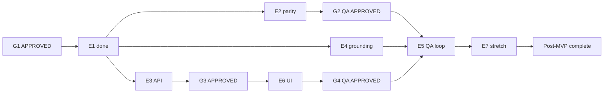

# Autonomous MVP + Post-MVP Conductor Playbook

**Command:** `/run-mvp` in Cursor (skill: [`.cursor/skills/run-mvp/`](../.cursor/skills/run-mvp/SKILL.md))

Runs the Formiqo harness from current state through **G4 QA APPROVED** (MVP ship), then continues into **post-MVP** work (**E5**, then stretch **E7**) without manual `/epic` or `/gate` between steps.

## Machine-readable next action

```bash
./scripts/harness-status.sh        # gates + sprint counts
./scripts/harness-next.sh          # human-readable
./scripts/harness-next.sh --json   # for agents / automation
```

## Pipeline (target end state)



## Gate open rules

| Gate | Open when |
|------|-----------|
| G1 | SA signs schemas + API contract |
| G2 | E2 complete; parity golden tests pass |
| G3 | E3 upload + file serving implemented |
| G4 | E6 matches mockups; e2e flow passes |

A gate **blocks** downstream work only as defined in [`specs/delegation-plan-mvp.md`](specs/delegation-plan-mvp.md).

**After G4:** the conductor does **not** stop. It runs post-MVP backlog (E5 → E7).

## Autonomous priority (what `/run-mvp` runs next)

### While G4 is not QA APPROVED (MVP)

| Priority | Condition | Action |
|----------|-----------|--------|
| 1 | Required gate PENDING and epic work complete | Run gate review |
| 2 | E2 not done (stamping parity) | `/epic E2` — blocks G2 → E5 |
| 3 | E4 not done | `/epic E4` — parallel with E2 |
| 4 | E6 not done and G1 + G3 approved | `/epic E6` — UI toward G4 |
| 5 | E2 done, G2 not QA APPROVED | `/gate G2` |
| 6 | G2 approved, E4 done, E5 not done | `/epic E5` |
| 7 | E6 done, G4 not QA APPROVED | `/gate G4` |
| 8 | Sprint empty, G4 still pending | `/sprint-plan` |

### After G4 QA APPROVED (post-MVP)

| Priority | Condition | Action |
|----------|-----------|--------|
| 1 | E5 has TODO rows | `/epic E5` |
| 2 | E7 has TODO rows | `/epic E7` |
| 3 | No E5 rows on active sprint | `/sprint-plan` — add post-MVP backlog |
| 4 | E5 done and E7 done (or E7 not queued) | **COMPLETE** — post-MVP done |

## Parallelization policy

| Concurrent | Allowed when |
|------------|--------------|
| E2 + E4 | E1 done; E4 does not start until E1 field schema landed |
| E2 + E6 | E6 uses API contract; live API after G3 |
| E4 + E6 | Default after G3 |
| E5 + E6 polish | After G2 + E4 |

**Never parallel:** Two agents editing `semantic_grounding.py` (sequence E1 → E4).

## Human stop conditions

The conductor **stops and asks** only when:

1. Gate verdict is **BLOCKED**
2. Epic acceptance criteria cannot be met without PRD change
3. Merge conflict or test failure after 2 fix attempts
4. Missing secret (API key) for LLM epics — document env vars needed
5. **`ACTION=complete`** with target `post-MVP` (E5 done; E7 done or not queued)

MVP ship (G4) is a **milestone**, not a hard stop for automation.

## Artifacts per cycle

- Sprint task status updates in `harness/sprints/sprint-NNN.md`
- PM summary: `harness/specs/pm-summary-run-mvp-YYYY-MM-DD.md`
- Gate reports when run: `harness/specs/security-review-*.md`, QA reports, etc.

## Cursor Automation

Optional scheduled kickoff: see [`automation/run-mvp-prompt.md`](automation/run-mvp-prompt.md).

**Important:** After updating the repo prompt, paste the new prompt into your existing Cursor Automation (the dashboard copy does not auto-sync from git).
